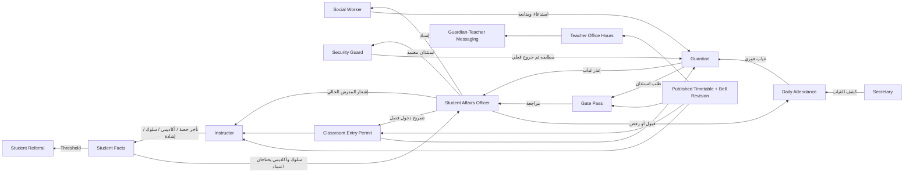

# خطة مراجعة أدوار شؤون الطلاب وتأثير جدول الحصص

**الحالة:** خطة فقط — لا تسمح هذه الوثيقة بأي تعديل برمجي أو Migration حاليًا  
**تاريخ الإعداد:** 2026-09-28  
**النطاق:** `Secretary`, `Instructor`, `StudentAffairsOfficer`, `Guardian`, `SecurityGuard`, `SocialWorker`, `SchoolManager` وكل الـ workflows المشتركة بينهم.

## 1. الهدف

نريد تنفيذ مراجعة منظمة للنظام الحالي قبل تعديل أي كود، بحيث نحقق الآتي:

1. استعادة وفهم Business Rules الخاصة بشؤون الطلاب والأدوار المرتبطة بها.
2. مطابقة الـ Business المكتوب مع التنفيذ الحقيقي في الـ Backend والـ Frontend.
3. حصر تأثير انتقال الجدول من `Day + Period Number` فقط إلى توقيتات فعلية دقيقة عبر `Bell Schedule`.
4. اختبار كل Role منفردًا، ثم اختبار نقاط التسليم بين الأدوار End-to-End.
5. تحديث الـ UI شاشة واحدة في كل مرة بعد تثبيت عقد الـ API والـ Business الخاص بها.
6. تحديث Role/Permission Matrix بدون توسيع صلاحيات أي Role بالخطأ.

## 2. خارج النطاق الآن

- لا تعديل على الكود في هذه المرحلة.
- لا إنشاء أو تعديل Migration.
- لا تعديل مباشر على قاعدة بيانات Production.
- لا إعادة تصميم شاملة لكل واجهات النظام دفعة واحدة.
- لا تغيير Business Rule لمجرد أن التنفيذ الحالي مختلف؛ التعارض يُسجّل أولًا ثم يُحسم صراحة.
- لا دمج `BellSchedule` داخل `SchoolStudentAffairsSettings` كـ JSON؛ النظام الحالي يملك نموذج توقيتات مستقلًا وأكثر نضجًا.

## 3. مصادر الحقيقة التي تمت مراجعتها

### وثائق البزنس الأساسية

- [`CONTEXT.md`](../CONTEXT.md)
- [`Phase1-Domain-And-Database-Schema.md`](Phase1-Domain-And-Database-Schema.md)
- [`Phase2-Identity-Roles-And-Permissions.md`](Phase2-Identity-Roles-And-Permissions.md)
- [`Phase3-Core-API-Contracts.md`](Phase3-Core-API-Contracts.md)
- [`Phase4-Workflows-And-State-Machines.md`](Phase4-Workflows-And-State-Machines.md)
- [`Phase5-Automations-And-Integrations.md`](Phase5-Automations-And-Integrations.md)

### وثائق الواجهات

- [`FE-Phase1-Foundation-And-Settings.md`](../FE-Phase1-Foundation-And-Settings.md)
- [`FE-Phase2-Dashboards-And-TeacherUI.md`](../FE-Phase2-Dashboards-And-TeacherUI.md)
- [`FE-Phase3-DailyOperations.md`](../FE-Phase3-DailyOperations.md)
- [`FE-Phase4-GatePass-Workflows.md`](../FE-Phase4-GatePass-Workflows.md)
- [`FE-Phase5-Summons-And-Messaging.md`](../FE-Phase5-Summons-And-Messaging.md)

### جدول الحصص الجديد

- [`02-timings.md`](specs/intelligent-timetable/02-timings.md)
- [`PHASE-TT-02-TIMINGS.md`](phases/PHASE-TT-02-TIMINGS.md)

### ترتيب الاحتكام عند التعارض

1. قرار Business مقفول وواضح في `CONTEXT.md` أو Phase 1–5.
2. أحدث مواصفة معتمدة للـ Intelligent Timetable.
3. عقد API الفعلي والـ DTOs الحالية.
4. التنفيذ الحالي والاختبارات الحالية بوصفهما **Baseline** وليس بالضرورة Business صحيحًا.
5. الـ UI الحالي؛ لا يُعامل كمصدر حقيقة للبزنس.

## 4. تصحيح مهم للـ Prompt القديم

الـ prompt القديم وصف Ripple Effect صحيح، لكن حال المشروع تغيّر بعد كتابته:

| النقطة القديمة | الوضع الحالي | نتيجة الخطة |
|---|---|---|
| إضافة `BellSchedule` داخل `SchoolStudentAffairsSettings` | تم بناء نموذج مستقل ومطبّع: Template → Revision → Day → Period/Break | نحافظ على الفصل؛ إعدادات شؤون الطلاب تظل للـ thresholds وموعد الحضور الصباحي فقط |
| تعديل `GetTeacherTopPriorityQuery` ليستخدم الوقت | `TeacherContextSchedule` و`BellScheduleResolver` يستخدمان الوقت المحلي وحدود الحصة بالفعل | نعمل مراجعة واختبارات حدود وتكامل، لا إعادة اختراع |
| تعديل Gate Pass ليحدد مدرس الحصة الصحيح | `ApproveGatePassCommandHandler` و`GatePassWorkflowRepository` يستخدمان توقيت الخروج المطلوب والنسخة المنشورة، ويأخذان substitution في الاعتبار | نثبت السلوك باختبارات API/E2E ونراجع الـ edge cases |
| Seeder كان يملأ كل الحصص | Seeder الحالي ينشئ ست حصص واقعية ويضع المعلم في الحصتين 1 و3 في أيام محددة | نراجع قابلية البيانات للاختبار اليدوي والنشر الفعلي للجدول |
| `AcbXX3KgvqD7B8Y4WjCu6yNx1Prfu5cNHz` هو Gate Pass handler | هذا الاسم حاليًا Domain Event لرفع عذر غياب واسم Migration؛ ليس Gate Pass handler | يمنع استخدام الاسم كمرجع معماري؛ المراجع الصحيحة هي Approve handler + workflow repository |

الـ Prompt القديم أغفل مستهلكين زمنيين مهمين يجب إضافتهم للنطاق:

- `ClassroomEntryPermit`: يحتاج تحديد الحصة والمدرس الحاليين.
- `TeacherOfficeHour`: يجب اشتقاق الساعات المتاحة من الحصص الفعلية والدوام.
- `Messaging`: تسليم Guardian → Teacher يعتمد على أقرب Office Hour صالح.
- `TimetableSubstitution`: المدرس الفعلي قد يختلف عن المدرس الأصلي في يوم محدد.
- الـ dashboards والـ notifications التي تعرض أو تربط أحداثًا بزمن الحصة.

## 5. تذكير سريع بالبزنس والأدوار

### 5.1 Secretary — سكرتير المدرسة

مسؤوليته الأساسية هي تجهيز البيانات التشغيلية اليومية:

- إدارة الفصول والطلاب في الواجهة الحالية.
- تسجيل كشف الغياب اليومي؛ يحدد الغائبين فقط، والباقي يُسجّل حاضرًا.
- استيراد تأخر الحضور الصباحي من زاجل عند تفعيل التكامل.
- تحرير/مراجعة الجدول عند منحه صلاحيات الجدول.

ليس من مسؤوليته:

- قبول الأعذار.
- اعتماد الاستئذان.
- معالجة الحالات الاجتماعية أو الاستدعاءات.
- اتخاذ قرار إرسال إشعارات السلوك أو الملاحظات الأكاديمية.

### 5.2 Instructor — المعلم

يتعامل فقط مع الفصل الذي يدرسه فعليًا في الحصة الحالية من الجدول المنشور:

- يرى الفصل والطلاب الحاليين.
- يسجل تأخر الحصة، ملاحظة أكاديمية، مخالفة سلوكية، أو إشادة.
- يقر باستلام إشعار استئذان خروج أو تصريح دخول فصل موجّه إليه.
- يحدد ساعاته المكتبية من الفترات المتاحة داخل الدوام وغير المتعارضة مع حصصه.
- يرد على رسائل ولي الأمر وفق سياسة الساعات المكتبية.

لا يجوز أن يختار فصلًا أو طالبًا عشوائيًا خارج الـ resolved context، إلا بمسار Override صريح ومدقق.

### 5.3 StudentAffairsOfficer — وكيل شؤون الطلاب

هو المنسق التشغيلي الرئيسي لشؤون الطلاب داخل المدرسة:

- إدارة بيانات الطلاب والتسجيلات وروابط أولياء الأمور وفق الصلاحيات المعتمدة.
- مراجعة أعذار الغياب وقبولها أو رفضها.
- متابعة التأخرات والملاحظات الأكاديمية والمخالفات والإشادات.
- إصدار تصريح دخول الفصل.
- اعتماد أو رفض طلبات استئذان الخروج ومتابعة التنفيذ.
- اعتماد/إخفاء إشعارات ولي الأمر الخاصة بالسلوك والملاحظات الأكاديمية.
- إنشاء/توجيه الإحالات للموجه الطلابي.
- مراجعة أثر إعادة حساب thresholds على الاستدعاءات الآلية.
- إدارة إعدادات thresholds لشؤون الطلاب.

ليس من مسؤوليته تنفيذ الخروج الفعلي عند البوابة أو إدارة جلسات الحالة الاجتماعية بدل الموجه.

### 5.4 Guardian — ولي الأمر

نطاقه هو أبناؤه المرتبطون به فقط من خلال `StudentGuardian` فعال:

- رؤية ملخص أبنائه والإشعارات المسموح بها.
- رفع عذر غياب إذا كان الرابط يسمح بذلك.
- طلب/إلغاء استئذان خروج قبل المراجعة إذا كان الرابط يسمح بذلك.
- متابعة قرار وحالة الاستئذان والاستدعاء.
- بدء محادثة مع المعلم أو شؤون الطلاب من سياق آمن.

لا يستطيع تصفح الطلاب أو تمرير `StudentId` عشوائي أو رؤية ملاحظات الحالات السرية.

### 5.5 SecurityGuard — حارس الأمن

يرى الحد الأدنى اللازم لتنفيذ الخروج:

- الاستئذانات المعتمدة في نافذة التنفيذ المناسبة.
- هوية الطالب/الصورة/الفصل وبيانات المستلم النصية التي أدخلها ولي الأمر.
- يعتمد المطابقة أولًا، ثم يسجل الخروج الفعلي في خطوة منفصلة.
- يسجل طريقة التحقق وملاحظة مختصرة.

لا يستطيع إنشاء أو اعتماد أو رفض الاستئذان، ولا يرى الغياب أو السلوك أو الحالات أو الرسائل.

### 5.6 SocialWorker — الموجه الطلابي / الأخصائي الاجتماعي

يعمل على الحالات المسندة إليه:

- قبول الإحالات ومتابعتها وتسجيل إجراءات الحالة.
- جدولة استدعاء ولي الأمر.
- تنفيذ دورة الاستدعاء: `Pending → Attended → UnderObservation → Improved`.
- تسجيل جلسة إرشاد أو توصية أو إحالة للجنة حقوق الطفل.
- التواصل مع ولي الأمر في نطاق الحالة.

لا يغير وقائع الغياب أو المخالفات لتغيير العداد، ولا يرى حالات غير مسندة بلا صلاحية صريحة.

### 5.7 SchoolManager — مدير المدرسة

- يرى مؤشرات مجمعة فقط لشؤون الطلاب.
- يدير المستخدمين وتعيين الأدوار.
- يراجع إعدادات شؤون الطلاب قراءةً، حسب الخريطة الحالية.
- يدير جدول المدرسة والساعات المكتبية على مستوى المدرسة.
- يملك مسار استثنائي مدقق لبعض حالات Gate Pass.

لا يرى ملاحظات الموجه السرية أو نصوص المحادثات أو الأدلة والمرفقات السرية لمجرد أنه مدير.

## 6. العلاقات بين الأدوار

## 7. الـ Business Workflows التي يجب الحفاظ عليها

### 7.1 الحضور والعذر

1. السكرتير يرسل IDs الغائبين فقط.
2. السيرفر يكتب كشفًا كاملًا: الغائبون `Absent` والباقي `Present`.
3. الغياب يرسل إشعارًا فوريًا لولي الأمر.
4. ولي الأمر يرفع عذر PDF؛ يصبح `Pending`.
5. الوكيل يقبل أو يرفض.
6. قرار الـ Business المقفول يقول إن القبول يحول الحالة إلى `AbsentExcused` مع بقاء الواقعة غيابًا رسميًا واستبعادها من عداد العقوبات.
7. عداد الغياب المؤثر: 3 تنبيه، 5 إحالة + استدعاء Pending، 10 مع توصية لجنة حقوق الطفل.

### 7.2 إجراءات المعلم السريعة

| الواقعة | إشعار ولي الأمر | التصعيد |
|---|---|---|
| غياب يومي | فوري | 3/5/10 |
| تأخر صباحي | فوري | الافتراضي 10/term |
| تأخر عن الحصة | فوري | عرض ومتابعة |
| ملاحظة أكاديمية | بعد اعتماد الوكيل | الافتراضي 3/term |
| مخالفة سلوكية | بعد اعتماد الوكيل | كل مضاعف للـ 10 افتراضيًا |
| إشادة | ليست ضمن قائمة الإشعار الإلزامي | إحصاءات إيجابية |
| تصريح دخول فصل | إشعار حالة مباشر | الافتراضي 5/term |

### 7.3 استئذان الخروج

`Requested → Approved → SecurityAcknowledged → Exited`

الحالات البديلة: `Rejected`, `Cancelled`, `Expired`.

- إقرار المعلم Receipt مستقل وليس Gate Pass state.
- الوكيل يحل المدرس المسؤول عند **وقت الخروج المطلوب** من الجدول المنشور.
- الحارس لا يستطيع القفز من `Approved` إلى `Exited`.
- وقت الخروج الفعلي Server-generated.
- كل انتقال يحمل `RowVersion` وسجلًا غير قابل للمحو.

### 7.4 الإحالة والاستدعاء

- الإحالة: `Open → Assigned → InProgress → Resolved/Closed` عن طريق Commands محددة، وليس Status عام.
- الاستدعاء له أربع حالات فقط: `Pending → Attended → UnderObservation → Improved`.
- تحديد الموعد لا ينشئ حالة `Scheduled`؛ هو substate من `Pending`.
- انخفاض العداد بعد تصحيح الواقعة لا يحذف التاريخ، بل يرفع `RequiresOfficerReview`.

### 7.5 المراسلات والساعات المكتبية

- ولي الأمر يستطيع إرسال رسالة للمعلم في أي وقت، لكن تنبيه المعلم قد ينتظر أقرب ساعة مكتبية.
- رد المعلم الروتيني يجب أن يكون في ساعة مكتبية صالحة أو عبر Override مدقق.
- رسائل ولي الأمر مع الوكيل أو الموجه غير مقيدة بساعات المعلم.
- نشر جدول جديد يعيد احتساب أهلية الساعات ويعلّم التعارضات للمراجعة.

## 8. قواعد الزمن التي تصبح Invariants مشتركة

هذه القواعد يجب أن تكون في Resolver/Service مشترك، لا نسخ LINQ مختلفة في كل Workflow:

1. المصدر التشغيلي هو `SchoolTimetable` المنشور والمثبت على `BellScheduleRevision` بعينها.
2. الحساب يتم بتوقيت المدرسة، لا بتوقيت جهاز المستخدم ولا timezone السيرفر الضمني.
3. حدود الحصة نصف مفتوحة: `Start <= now < End`.
4. عند نهاية الحصة بالضبط لا تُحسب الحصة السابقة.
5. أثناء break أو gap أو يوم غير دراسي أو خارج الدوام تكون `CurrentPeriod = null`.
6. لا يتم اختيار مدرس عشوائي عند الغموض أو غياب الجدول.
7. `SchoolTimetableEntry.Period` يظل Sequence key، لكن صحته تأتي من اليوم الفعلي في الـ Bell Revision.
8. عند وجود substitution لليوم، المدرس البديل هو المدرس التشغيلي، مع الاحتفاظ بالأصلي في التاريخ.
9. Gate Pass يحتفظ snapshot للمدرس/الفصل/الحصة وقت الاعتماد حتى لو تغير الجدول بعد ذلك.
10. تعديل Template لا يغير جدولًا منشورًا تاريخيًا بصمت؛ يلزم revision وإعادة validation/publication.

## 9. Baseline التنفيذ الحالي والفجوات المكتشفة

> البنود التالية نتيجة مراجعة ثابتة للكود الحالي. يجب إعادة التحقق منها باختبارات Runtime في Phase 0 قبل إصلاحها.

| الأولوية | المنطقة | الموجود حاليًا | الفجوة/القرار المطلوب |
|---|---|---|---|
| جيد | Bell Schedule model | Template/Revision/Days/Periods/Breaks وتثبيت النسخة المنشورة موجود | الحفاظ عليه كمصدر حقيقة وعدم نسخه في Student Affairs settings |
| جيد | Teacher current context | يستخدم `TeacherContextSchedule` وحدود الوقت ويغلق off-hours fallback | إضافة تغطية Integration/API للحدود والـ substitutions وعدم الاكتفاء باختبار handler stub |
| جيد | Gate Pass teacher resolution | يستخدم وقت الخروج المطلوب، اليوم المحلي، Bell revision، classroom، وsubstitution | إضافة سيناريوهات end boundary/break/gap/changed timetable وإثبات عدم الإشعار الخاطئ |
| جيد جزئيًا | Student Affairs Seeder | ينشئ 6 حصص واقعية ومدرسًا في 1 و3 | إثبات أن E2E timetable منشور فعلًا وقابل للاستخدام، وأن بيانات manual test تغطي الوقت الحالي أو Test Clock |
| P0 | Classroom Entry Permit | Controller وDTOs موجودان | لا توجد handlers قابلة للاكتشاف للإنشاء/القائمة/detail/ack/revoke؛ لا يبدأ UI قبل إكمال العقد |
| P0 | Office Hours | جداول وEndpoints وUI موجودة شكليًا | `eligible` يعيد السجلات الحالية، وعمليات update/override لا تحفظ تغييرًا فعليًا؛ لا اشتقاق من Bell Schedule |
| P0 | Messaging time policy | إنشاء الرسالة موجود | الإرسال الحالي يختار `SentImmediately` دائمًا ويعيد Delivered رغم أن receipt يُنشأ Pending؛ سياسة office-hours غير منفذة |
| P0 | Absence excuse acceptance | يتم قبول العذر وتحديث `ExcuseStatus` | التنفيذ والاختبار الحاليان يبقيان attendance=`Absent`، بينما البزنس المقفول يقول `AbsentExcused`؛ يلزم قرار توحيد قبل UI regression |
| P0 | Missing MediatR handlers | أغلب المسارات الأساسية موجودة | توجد Requests بدون handlers ظاهرة في permits وconduct/delays/recognitions/automation؛ أي Endpoint منها قد يفشل Runtime |
| P1 | Login landing | Secretary/Instructor/Officer لهم تحويلات | Guardian/SocialWorker/SecurityGuard يسقطون إلى `/dashboard` العام، والOfficer يذهب إلى settings بدل operational dashboard |
| P1 | Shell navigation | كثير من الشاشات متاحة حسب الدور | لا يوجد Dashboard link واضح للGuardian/Security/SocialWorker/Officer، وبعض الشاشات المصرح بها غير ممثلة |
| P1 | Officer UI scope | الوكيل يملك صلاحيات إدارة student/enrollment/guardian links | Routes إدارة الطلاب والفصول مقيدة حاليًا بالـ Secretary؛ يلزم حسم UX بدون خلط مسؤولية كشف الحضور |
| P1 | School Manager oversight | Endpoint وRoute موجودان | ليس واضحًا كـ landing/navigation، ويجب اختبار عدم تسريب بيانات سرية |
| P1 | Social Worker assignment | Referral assignment contract موجود | لا يوجد lookup آمن للموجهين القابلين للإسناد؛ الـ UI spec نفسه يعتبر selector محجوبًا |
| P1 | Guardian teacher selection | عقد بدء محادثة موجود | لا يوجد lookup آمن لمعلمي الطالب المرتبط؛ يمنع free IDs |
| P1 | Frontend tests | shell tests + attendance layout test | بقية مكونات شؤون الطلاب بلا component tests ظاهرة تقريبًا |
| P2 | Documentation drift | وثائق البزنس غنية | بعض الملفات ما زالت تقول “no implementation authorized”، وGate Pass FE يقول Saturday–Thursday بينما الجدول الجديد يسمح بأي يوم محدد كدراسي |

### 9.1 Requests المهمة بلا Handler ظاهر حاليًا

يُعاد فحص التسجيل Runtime أولًا، ثم تُصنف إلى Implement / Remove dead contract / Defer:

- Classroom Entry Permit: create, list, detail, acknowledge, revoke.
- Behavior: list, detail, classify, dispatch decision, refer, correct.
- Academic Concern: list, detail, dispatch decision, correct.
- Morning Delay: list/detail, add reason, correct.
- Session Delay: list/detail, correct.
- Recognition: list/detail/statistics, correct.
- Automation: rules, triggers, failures, retry.

## 10. استراتيجية الاختبار

كل Role يمر عبر خمس طبقات قبل اعتباره جاهزًا:

1. **Business tests:** transitions، thresholds، ownership، time boundaries.
2. **Application tests:** handler registration، permissions، object scope، idempotency، row version.
3. **Repository/SQL tests:** الاستعلام الحقيقي، tenant isolation، timezone، unique constraints، concurrency.
4. **API contract tests:** HTTP status + `ApiResponse`, DTO shape، 401/403/404/409، files.
5. **Frontend + Manual E2E:** route، navigation، loading/empty/error/conflict، RTL/mobile، workflow الفعلي.

### قاعدة العمل لكل شاشة

لا نبدأ تعديل UI لشاشة قبل تحقق التالي:

- الـ endpoint له handler فعلي ومسجل.
- الـ DTO نهائي لهذه الشاشة.
- قواعد الصلاحيات والـ object scope مغطاة.
- حالات 400/403/409 معروفة وثابتة.
- fixture صالحة للاختبار اليدوي موجودة.

## 11. بيانات QA المطلوبة قبل بدء اختبار الأدوار

### 11.1 مدرسة اختبار معزولة

- `SchoolTimeZoneId` صريح.
- Academic Year + active term يغطيان تاريخ الاختبار.
- فصلان على الأقل، وطالبان في كل فصل.
- ولي أمر مرتبط بطالب A وغير مرتبط بطالب B لاختبارات المنع.
- معلّمان، وموجهّان اثنان لاختبار assignment isolation.
- جدول منشور ونسخة Bell مثبتة.
- substitution في يوم محدد.

### 11.2 جدول زمني مرجعي

مثال مقترح، مع السماح بتغيير الساعات حسب بيئة QA:

| الفترة | الوقت | الغرض الاختباري |
|---|---|---|
| Period 1 | 07:00–07:45 | current period طبيعي |
| Gap | 07:45–07:50 | يجب ألا يوجد مدرس حالي |
| Period 2 | 07:50–08:35 | اختبار start/end boundary |
| Break | 08:35–08:55 | يجب ألا يوجد مدرس حالي |
| Period 3 | 08:55–09:40 | فصل أو معلم مختلف |
| Day override | يوم واحد بتوقيت مختلف | اختبار override |
| Non-study day | يوم واحد على الأقل | رفض Gate Pass/current context |

### 11.3 التحكم في الوقت

- الاختبارات الآلية تستخدم `FakeTimeProvider` أو Fixed Time.
- الاختبار اليدوي لا يعتمد على تغيير ساعة الجهاز.
- نختار أحد مسارين قبل التنفيذ:
  - Development-only Test Clock عبر DI، مع منع تشغيله خارج Development.
  - Template QA مؤقت يحيط الوقت الحالي ثم يُعاد نشره عمدًا.
- يجب اختبار ثانية البداية، لحظة النهاية، gap، break، يوم غير دراسي، timezone offset، وتغيير التوقيت الصيفي إن كان الـ timezone يدعمه.

### 11.4 حسابات التطوير الحالية

كلها داخل `Al-Falah E2E Test School` وكلمة المرور الحالية `Test@1234`:

| الدور | Username |
|---|---|
| SchoolManager | `admin.test` |
| StudentAffairsOfficer | `officer.test` |
| SocialWorker | `socialworker.test` |
| Secretary | `secretary.test` |
| SecurityGuard | `guard.test` |
| Instructor | `teacher.test` |
| Guardian | `parent.test` |

يجب التأكد في Phase 0 أن الحسابات مرتبطة بنفس المدرسة النشطة وأن claims تم تجديدها بعد أي تعديل permissions.

## 12. ترتيب التنفيذ Role-by-Role

الترتيب يعتمد على dependencies، مع الحفاظ على تحديث واجهة Role واحد في كل iteration. في الـ workflows المشتركة نستخدم fixtures/API لتجهيز الحالة حتى يحين دور واجهة الطرف الآخر، ثم نعيد السيناريو كاملًا بعد اكتمال الطرفين.

### Phase 0 — Audit وتثبيت الـ Baseline

#### Backend

- [ ] تشغيل كل الاختبارات الحالية وتسجيل النتائج بدل الاعتماد على تقارير سبتمبر القديمة.
- [ ] توليد OpenAPI الحالي وحصر كل Student Affairs endpoint.
- [ ] عمل request-to-handler registration test لكل `IRequest`.
- [ ] تصنيف الـ missing handlers المذكورة في 9.1.
- [ ] مقارنة `PermissionNames` و`DatabaseSeeder.GetRolePermissionMap()` مع Phase 2.
- [ ] التحقق من school scoping لكل repository/query.
- [ ] التحقق من أن جدول E2E منشور وله version snapshot وBell revision.
- [ ] حسم تعارض `Absent` مقابل `AbsentExcused` بعد قبول العذر.

#### Frontend

- [ ] استخراج route/navigation/service/component inventory فعلي.
- [ ] توثيق Landing الحالي لكل Role.
- [ ] ربط كل route بالـ permissions والـ endpoints التي يستخدمها.
- [ ] تسجيل الشاشات التي تبدو كاملة بصريًا لكن endpoint الخاص بها بلا handler أو no-op.

#### Exit gate

- لدينا Baseline report موثق، ولا يوجد endpoint “أخضر” لمجرد أنه يبني Compile.

### Phase 1 — الأساس المشترك للـ Roles والوقت

- [ ] خدمة زمن واحدة تعتمد school timezone وBell revision المنشورة.
- [ ] منع fallback إلى أول حصة/مدرس عند gap أو ambiguity.
- [ ] دعم المدرس البديل في lookup التشغيلي.
- [ ] توحيد 403 object-scope و409 concurrency وتجربة الـ UI لهما.
- [ ] تصحيح login redirects وDashboard links لكل الأدوار السبعة.
- [ ] Route/menu contract tests لكل Role.
- [ ] عدم وضع Business logic زمني داخل Angular.

#### Exit gate

- كل Role يدخل إلى Landing صحيح، ويرى روابطه فقط، والدخول المباشر لرابط غير مصرح ينتج Denial صحيحًا.

### Role 1 — Secretary

#### Business/API checks

- [ ] إدارة الفصول والطلاب والتسجيلات ضمن المدرسة فقط.
- [ ] كشف الحضور: checked = Absent، unchecked = Present.
- [ ] empty absent list يعني الجميع حاضر.
- [ ] roster revision conflict لا يمسح اختيار المستخدم.
- [ ] لا يعيد حفظ `AbsentExcused` بطريقة تعيده Present/Absent خطأ.
- [ ] Zajel يستخدم `ArrivalCutoffLocalTime + Grace` ولا يستخدم Bell periods كبديل.
- [ ] صلاحيات timetable editor منفصلة عن مسؤولية الحضور.

#### Timetable checks

- [ ] إنشاء/اختيار Bell template للعام والفصل الدراسي.
- [ ] study days وday overrides وbreaks.
- [ ] حفظ revision ثم validation/publication.
- [ ] تغيير التوقيت يعلّم dependants لإعادة المراجعة ولا يغيّر المنشور بصمت.

#### UI iteration

- [ ] Landing واضح للسكرتير.
- [ ] مراجعة إدارة الفصول والطلاب وكشف الحضور.
- [ ] مراجعة شاشة Timing كـ source of truth، وعدم إضافة periods في Student Affairs Settings.
- [ ] حالات RTL/mobile/loading/empty/conflict.

#### Negative tests

- لا يقبل عذرًا، لا يعتمد Gate Pass، لا يرى case notes، لا ينفذ خروجًا.

### Role 2 — Instructor

#### Current-context matrix

- [ ] قبل بداية الحصة: `currentPeriod=null`.
- [ ] عند البداية بالضبط: الحصة فعالة.
- [ ] قبل النهاية بلحظة: الحصة فعالة.
- [ ] عند النهاية بالضبط: الحصة غير فعالة.
- [ ] gap/break/non-study day: لا فصل ولا roster actions.
- [ ] day override: يعرض وقت اليوم الفعلي.
- [ ] substitution: البديل فقط يستطيع الفعل في ذلك اليوم.
- [ ] جدول Draft لا يدخل في current context.
- [ ] أكثر من match أو revision غامضة: fail closed.

#### Quick actions

- [ ] الطالب يأتي من roster الحالي فقط.
- [ ] Behavior/Academic/Session Delay تحمل `timetableEntryId` الحالي.
- [ ] Recognition تظل مربوطة باختيار roster حتى لو DTO لا يحمل entry ID.
- [ ] Behavior/Academic تظهر Pending Officer Decision، لا “تم إشعار ولي الأمر”.
- [ ] Session Delay يعرض حالة التسليم الحقيقية.
- [ ] Gate Pass وEntry Permit acknowledgements تخص المدرس الفعلي فقط.

#### Office hours and messaging

- [ ] اشتقاق eligible slots من Bell periods والجدول المنشور والدوام.
- [ ] استبعاد الحصص والـ standby والـ breaks غير المؤهلة.
- [ ] حفظ اختيار المعلم فعليًا مع version واضح.
- [ ] نشر جدول جديد يعلّم الساعات المتعارضة.
- [ ] رد المعلم خارج الساعة المكتبية لا يصبح Delivered فورًا بلا policy.

#### UI iteration

- [ ] Top Priority header يعرض الوقت المحلي ونهاية الحصة.
- [ ] boundary refresh عند `endsAt` وعلى focus.
- [ ] null context وempty roster وrevision changed states.
- [ ] quick-action forms واحدة واحدة.
- [ ] acknowledgements ثم Office Hours ثم Messaging.

#### Negative tests

- لا يختار فصلًا/طالبًا عشوائيًا، لا يرى case notes، لا يعتمد Gate Pass، ولا يرسل routine reply خارج policy.

### Role 3 — StudentAffairsOfficer

#### Role/RBAC

- [ ] Landing = operational Officer dashboard، لا settings فقط.
- [ ] حسم واجهة إدارة الطلاب/التسجيلات/guardian links بما يطابق الصلاحيات الحالية.
- [ ] عدم منحه attendance roster submission الخاص بالسكرتير.

#### Operational workflows

- [ ] settings thresholds/history/create/update/reset مع row version.
- [ ] review excuse، وحسم/تطبيق `AbsentExcused` وإعادة حساب العداد.
- [ ] morning/session/behavior/academic/recognition views بعد إكمال handlers.
- [ ] notification approval queue للسلوك والأكاديمي فقط.
- [ ] referral create/assign مع lookup آمن للموجهين.
- [ ] automation-impact review للاستمارات المتأثرة بانخفاض العداد.

#### Time-sensitive workflows

- [ ] إصدار Classroom Entry Permit يحل الفصل والمدرس الحاليين من Bell schedule.
- [ ] break/gap يمنع اختيار مدرس عشوائي ويعرض fallback تشغيلي صريح.
- [ ] Gate Pass approval يستخدم وقت الخروج المطلوب وليس وقت ضغط Approve.
- [ ] window يجب أن تحتوي وقت الخروج وتبقى مستقبلية.
- [ ] substitution وقت الخروج يوجه الإشعار للمدرس البديل.
- [ ] snapshot يظل ثابتًا إذا تغير الجدول بعد الاعتماد.

#### UI iteration

- [ ] Officer dashboard.
- [ ] Excuse review.
- [ ] Classroom Entry Permit screen بعد إكمال الـ backend.
- [ ] Gate Pass queue.
- [ ] Notification approvals.
- [ ] Referral assignment وautomation review.
- [ ] Student Affairs settings آخرًا لأنها ليست Landing تشغيليًا.

#### Negative tests

- لا ينفذ الخروج، لا يغير حالة Social Worker case بدل صاحبه، ولا يعمل cross-school mutation.

### Role 4 — Guardian

#### Scope and privacy

- [ ] Landing = `أبنائي`.
- [ ] كل student ID يأتي من active `StudentGuardian` link.
- [ ] تغيير URL إلى طالب غير مرتبط يعطي denial آمنًا.
- [ ] capabilities: `CanSubmitExcuses`, `CanRequestGatePass`, `ReceivesNotifications` محترمة.

#### Excuses

- [ ] يظهر upload للغياب المؤهل فقط.
- [ ] PDF فقط والحجم/النوع/التنزيل المصرح.
- [ ] Pending/Accepted/Rejected واضحة، وإعادة fetch بعد قرار الوكيل.

#### Gate Pass

- [ ] الطلب يسمح بأي **configured study day**؛ لا hard-code Friday rejection.
- [ ] الوقت في المستقبل وفي فترة حصة فعلية حسب policy المعتمدة.
- [ ] overlap ±30 دقيقة وIdempotency-Key.
- [ ] الإنشاء يظهر Requested وليس Approved.
- [ ] الإلغاء قبل المراجعة فقط.
- [ ] متابعة Approved/SecurityAcknowledged/Exited/Rejected/Expired.

#### Summons, notification, messaging

- [ ] يرى استدعاءه وحالته بدون notes داخلية.
- [ ] يبدأ thread من student/teacher context موثوق، لا free instructor ID.
- [ ] الرسالة للمعلم خارج office hours تظهر Queued وليست Delivered.
- [ ] لا يرى guardian آخر أو case notes.

#### UI iteration

- [ ] Guardian dashboard وnavigation/landing.
- [ ] Excuse upload/history.
- [ ] Gate Pass request + own list.
- [ ] Summons/status surface.
- [ ] Messages + notifications.

### Role 5 — SecurityGuard

#### Workflow

- [ ] Landing = Security queue/dashboard.
- [ ] يعرض Approved وSecurityAcknowledged المناسبين فقط.
- [ ] minimum projection فقط.
- [ ] acknowledge داخل النافذة وبـ latest row version.
- [ ] exit بعد acknowledge فقط.
- [ ] verification method + note مطلوبان.
- [ ] `ActualExitAt` من السيرفر.
- [ ] timeout بعد network failure يعيد fetch قبل إعادة المحاولة.
- [ ] acknowledged but not exited يظهر كـ overdue/expired exception.

#### UI iteration

- [ ] توحيد read-only summary مع execution queue بدون خلط الصلاحيات.
- [ ] large touch targets، countdown، stale-card refresh، final confirmation.
- [ ] لا روابط لأي attendance/behavior/referral/message data.

#### Negative tests

- لا ينشئ/يعتمد/يرفض Gate Pass، لا يقفز مباشرة إلى Exited، ولا يرى بيانات سرية.

### Role 6 — SocialWorker

#### Referrals

- [ ] يرى الحالات المسندة أو المسموحة فقط.
- [ ] accept ثم add action ثم resolve/reopen عبر endpoints منفصلة.
- [ ] source snapshot التاريخي لا يُستبدل بالعداد الحالي.
- [ ] confidential actions لا تظهر للمدير أو الإشعارات.

#### Summons

- [ ] الحالات الأربع فقط وبالترتيب.
- [ ] schedule/reschedule يبقى Pending.
- [ ] no-show لا يصبح Attended.
- [ ] observation plan وoutcome evidence مطلوبان.
- [ ] row-version conflict يحفظ المسودة ويعرض الانتقال الفائز.
- [ ] انخفاض source count يظهر Officer Review ولا يحذف الاستدعاء.

#### Messaging

- [ ] relevant guardian threads فقط.
- [ ] غير مقيد بساعات المعلم، مع الحفاظ على case privacy.

#### UI iteration

- [ ] Social Worker landing/dashboard.
- [ ] Cases Kanban/List.
- [ ] Case drawer/actions.
- [ ] Summons list/detail/state stepper/history.
- [ ] Messaging.

### Role 7 — SchoolManager

#### Oversight and privacy

- [ ] Landing أو Navigation واضح للـ school oversight.
- [ ] الحضور يعرض aggregates حسب الفصل.
- [ ] case/summon thresholds تعرض counts/status فقط.
- [ ] DTO لا يحتوي أسماء طلاب في أقسام الحالات ولا guardian IDs ولا message bodies ولا case notes.

#### Administrative boundaries

- [ ] Student Affairs settings read-only حسب seed map.
- [ ] إدارة Bell Schedule والجدول حسب صلاحيات timetable.
- [ ] Office-hour override يحفظ فعليًا ويطلب reason.
- [ ] Gate override استثنائي ومدقق فقط، وليس Approve handler الخاص بالوكيل.
- [ ] تعيين الأدوار يجبر token renewal.

#### UI iteration

- [ ] Oversight dashboard.
- [ ] Read-only Student Affairs settings.
- [ ] Teacher office-hour override.
- [ ] Exceptional audit/override surfaces المعتمدة فقط.

## 13. سيناريوهات E2E المشتركة بعد اكتمال الأدوار

### Scenario A — غياب وعذر

`Secretary marks Absent → Guardian notified → Guardian uploads PDF → Officer accepts → status/metric recalculated → Guardian sees decision`

قبول السيناريو يتطلب إثبات عدم احتساب اليوم في penalty metric مع بقائه غيابًا رسميًا.

### Scenario B — مخالفة واعتماد إشعار

`Instructor records Behavior → Pending Officer Decision → Officer approves/suppresses → Guardian notification state matches decision → threshold action remains idempotent`

### Scenario C — استئذان كامل

`Guardian requests → Officer approves at desired-period teacher → Instructor acknowledges → Guard acknowledges → Guard records exit → Guardian/Officer see completion`

يُعاد السيناريو داخل حصة، في gap، عند boundary، ومع substitution.

### Scenario D — تصريح دخول فصل

`Officer issues during current lesson → actual teacher receives → teacher acknowledges → Guardian sees status → repetition metric updates`

### Scenario E — Threshold إلى موجه طلابي

`Fact crosses threshold → one referral + one trigger ledger → Officer assigns → Social Worker accepts → schedules summons → Guardian sees appointment → Attended → UnderObservation → Improved`

### Scenario F — تصحيح يخفض العداد

`Behavior threshold crossed → summons exists → incident corrected/deleted/downgraded → metric decreases → summons preserved + RequiresOfficerReview → Officer records decision`

### Scenario G — Office Hours بعد تغيير الجدول

`Teacher selects eligible free slot → Guardian message queues outside slot → timetable republished with lesson conflict → slot flagged → next eligible delivery recalculated`

## 14. خطة تحديث الـ UI شاشة واحدة في كل مرة

لكل شاشة نستخدم نفس الدورة:

1. **Contract card:** الدور، الصلاحيات، endpoint، DTO، states، errors.
2. **API smoke:** happy path + 403 + object denial + 409 إن وجد.
3. **Component tests:** loading, empty, populated, validation, error, stale/concurrency.
4. **UI update:** RTL، responsive، accessibility، terminology.
5. **Manual role test:** بالحساب المخصص وتسجيل evidence.
6. **Cross-role handoff:** إذا كانت الشاشة تنتج حالة لدور آخر.
7. **Regression:** بقية الأدوار لا ترى route أو data الجديدة.

لا ننتقل للشاشة التالية قبل إغلاق نتيجة الشاشة الحالية إلى واحدة من:

- `PASS`.
- `BLOCKED — business decision`.
- `BLOCKED — backend contract`.
- `DEFERRED — explicitly out of scope`.

## 15. قواعد معمارية عند بدء التنفيذ لاحقًا

- Controller يبقى thin وينادي MediatR/Application use case فقط.
- Business/time resolution لا يوضع في Controller أو Angular.
- Repository يتولى EF query، لكن قواعد workflow تبقى في handler/service.
- لا يرجع `IQueryable` خارج طبقة البيانات.
- كل screen/use case له DTO واضح؛ لا نرجع Entity خام.
- كل mutation تتحقق من `SchoolId`, permission, object scope, state, row version.
- لا DB query داخل loop عند حل الطلاب/الإشعارات/المدرسين.
- كل external notification عبر outbox ولا ترجع transaction صحيحة بسبب فشل delivery.
- الـ published Bell revision immutable للتشغيل التاريخي.
- أي fallback يحتاج Permission + reason + audit؛ لا fallback صامت.

## 16. Automation المطلوبة

### Backend

- Request/handler registration test يغطي كل Student Affairs request.
- Role-permission canonical map tests لكل دور.
- Controller contract tests للـ status codes/envelopes.
- SQL-backed tests للـ timezone، Bell boundaries، substitutions، concurrency.
- Privacy projection tests للحارس والمدير وولي الأمر والموجه.
- Idempotency tests للـ Gate Pass، excuse upload، attendance sheet، referrals/summons، notifications.

### Frontend

- Route guard matrix لكل الأدوار السبعة.
- Shell navigation snapshot/contract لكل دور.
- Service contract tests للـ query params، multipart، blobs، idempotency keys.
- Component tests لكل شاشة تشغيلية.
- E2E browser journeys للسيناريوهات A–G.
- RTL/mobile overflow وkeyboard/focus/error-summary tests.

## 17. Definition of Done لكل Role

- [ ] البزنس الخاص بالدور موثق ولا يوجد تعارض غير محسوم.
- [ ] Permission map والـ exact-role checks متطابقان.
- [ ] كل endpoint تستخدمه واجهته له handler واختبار Runtime.
- [ ] object-level authorization وcross-school denial ناجحان.
- [ ] الحالات الزمنية الخاصة بالدور مغطاة.
- [ ] UI route/navigation/landing صحيحة.
- [ ] loading/empty/error/403/409 states موجودة.
- [ ] RTL/mobile/accessibility مقبولة.
- [ ] manual checklist ناجحة بالحساب الخاص بالدور.
- [ ] handoff مع الأدوار الأخرى ناجح.
- [ ] لا تسريب بيانات خارج نطاق الدور.
- [ ] regression suite خضراء.
- [ ] تم تحديث الوثيقة بنتيجة `PASS/BLOCKED/DEFERRED` والأدلة.

## 18. قرارات يجب حسمها في بداية التنفيذ

1. هل الحالة الرسمية بعد قبول العذر ستكون `AbsentExcused` كما تقول الوثائق، أم `Absent + ExcuseStatus.Accepted` كما يفعل الكود الآن؟ يجب اختيار نموذج واحد وتوحيد metrics/Noor/UI عليه.
2. هل نضيف Development-only Test Clock للاختبار اليدوي، أم نختبر عبر تعديل Template QA وإعادة نشره؟
3. ما شاشة الـ canonical landing لكل من Officer وSocial Worker وSecurity Guard وGuardian؟ الاقتراح: dashboards الخاصة بهم.
4. هل إدارة الطلاب/التسجيلات/guardian links تظهر للوكيل أيضًا، أم تبقى واجهة الإدخال للسكرتير مع صلاحيات مختلفة؟ البزنس الحالي يمنح الوكيل الإدارة، بينما routes الحالية لا تفعل.
5. ما lookup الآمن للموجهين القابلين للإسناد؟
6. ما lookup الآمن لمعلمي الطالب لبدء Guardian–Teacher conversation؟
7. هل Gate Pass يجب أن يكون وقت خروجه داخل Lesson فقط أم يسمح أثناء break/نهاية اليوم بمسار policy مختلف؟ التنفيذ الحالي يحتاج period صالح وقت الاعتماد.
8. ما حدود duty time التي تُشتق داخلها Office Hours، ومن أين تأتي؟

## 19. ترتيب حزم العمل المقترح بعد اعتماد الخطة

| الحزمة | الناتج | شرط البدء |
|---|---|---|
| W0 Baseline Audit | تقرير العقود/handlers/permissions/tests | الآن |
| W1 Shared Time + RBAC | resolver contract + role landings + guard tests | W0 |
| W2 Secretary | timetable/data/attendance UI validated | W1 |
| W3 Instructor | current context + quick actions | W2 published fixture |
| W4 Office Hours/Messaging core | timetable-derived availability + delivery policy | W3 |
| W5 Officer | operational dashboard + reviews + permits + approvals | W1/W3 |
| W6 Guardian | dashboard + excuses + gate request + messages | W5 contracts stable |
| W7 Security | minimal queue + two-step exit | W5/W6 gate flow |
| W8 Social Worker | referrals + summons + case messaging | W5 assignment contract |
| W9 School Manager | aggregate oversight + audited overrides | prior projections stable |
| W10 Cross-role E2E | scenarios A–G + regression report | W2–W9 |

## 20. النتيجة المطلوبة من أول جلسة تنفيذ

أول جلسة لا تبدأ من `SchoolStudentAffairsSettings + BellSchedule` كما يقترح الـ prompt القديم. تبدأ بـ **W0 Baseline Audit**، ثم تنتج ثلاث قوائم معتمدة:

1. ما تم تنفيذه ويحتاج اختبار فقط.
2. ما هو ناقص أو no-op ويحتاج Implementation.
3. ما يتعارض مع Business ويحتاج قرارًا قبل كتابة الكود.

بعدها نبدأ `Secretary` ثم `Instructor`، لأن صحة بيانات المدرسة والجدول والسياق الزمني شرط لباقي الأدوار.
