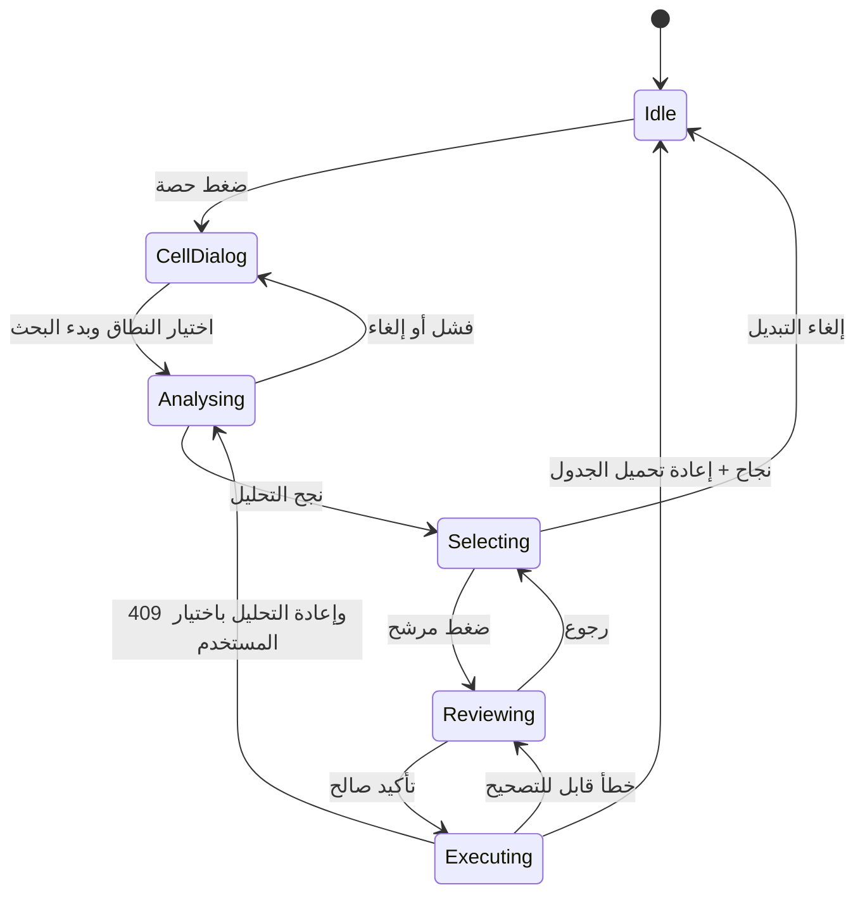

# خطة تجربة التبديل داخل الجدول الدراسي

**الحالة:** قيد التنفيذ — اكتملت المراحل 0–3، بما فيها `SameDay` و`WholeTimetable`، وتبقى أعمال الصقل والتحقق البصري في المرحلتين 4–5  
**التاريخ:** 2026-09-16  
**النطاق:** واجهة الجدول الدراسي + عرض نتائج التبديل فوق الشبكة + إعادة استخدام محرك Phase 8  
**قاعدة انتقال إلزامية:** تبقى شاشة **التبديل والاحتياطي** الحالية ومسارها `/intelligent-timetable/substitutions` كما هما حتى اعتماد قرار حذفها أو دمجها لاحقًا.

## حالة التنفيذ — 2026-09-16

- اكتملت المرحلة 1: `EntryId` في read model، و`InlineSwapSessionStore`، ومكونات العرض المنفصلة، والإلغاء الآمن للطلب المتأخر.
- اكتمل vertical slice للمرحلة 2: عقد `inline-candidates` فوق محرك Phase 8 نفسه، والاختيار والتلوين والمراجعة والتنفيذ وإعادة تحميل الجدول لمسار `SameDay`.
- اكتملت المرحلة 3: فُعّلت بطاقة **كل أيام الجدول**، وأصبح المحرك ينقل `Day + Period` ويتحقق بأوقات يوم الوجهة، مع حفظ يوم الوجهة في سجل الحركة.
- اعتُمدت سياسة أن أي مرشح cross-day يلمس احتياطيًا مستقبليًا مؤكدًا يصبح `Red` بلا نقل أو إلغاء تلقائي للاحتياطي.
- تظل شاشة **التبديل والاحتياطي** القديمة ومسارها بلا تغيير، ويظل الاحتياطي اليومي فيها في هذه النسخة.
- تحقق التنفيذ آليًا عبر 477 اختبار backend و84 اختبار frontend وproduction build ناجح، وأكد EF عدم وجود model changes خارج الـ migration المسجل.

## 1. النتيجة المطلوبة

نقل نقطة بدء **تبديل الحصص البنيوي** إلى شاشة **الجدول الدراسي** نفسها، بحيث:

1. يضغط المستخدم المخوّل على حصة محفوظة داخل الجدول.
2. تظهر النافذة الحالية بعد تطويرها إلى تبويبين:
   - **التعديل**: يحتفظ بسلوك التعديل الحالي.
   - **التبديل**: يقدّم مساري بحث واضحين.
3. يختار المستخدم:
   - **داخل اليوم نفسه**: يستخدم منطق التبديل الحالي نفسه.
   - **كل أيام الجدول**: يبحث بين أيام الأسبوع كلها؛ وهذا توسع backend جديد موضح في §10.
4. تظهر تجربة تحميل بصرية حديثة أثناء فحص القيود، ثم تغلق نافذة الحصة تلقائيًا.
5. يعود الجدول إلى الواجهة في **وضع اختيار التبديل**، مع تلوين الخانات وتصنيفها وإظهار زر إلغاء ثابت وواضح.
6. الضغط على خانة مرشحة يفتح مراجعة قبل/بعد، وتحذيرات أو أسباب عدم الإتاحة، ثم التأكيد الآمن بالمنطق الحالي.
7. بعد النجاح يعاد تحميل الجدول من الخادم، يظهر رقم المراجعة الجديد، وتعود الواجهة للوضع الطبيعي.

هذه الإضافة لا تنقل قواعد العمل إلى الواجهة؛ الألوان والحركات والقرار النهائي تظل ناتجة من الخادم، ويعاد التحقق منها داخل المعاملة عند التأكيد.

## 2. ما تم التحقق منه في النظام الحالي

### الواجهة الحالية

- `school-timetable.component` يعرض شبكة المعلمين × الأيام × الفترات.
- الضغط على الخلية يفتح نافذة **تعديل الفترة** فقط.
- الشبكة تدعم السحب والإفلات والنسخ واللصق وملء الشاشة.
- نموذج `TimetableEntry` في واجهة الجدول لا يحتوي حاليًا على معرّف صف الحصة `EntryId`، بينما API التبديل يتطلب `sourceEntryId`.
- التعديلات داخل محرر الجدول تبقى محلية حتى الضغط على **حفظ**؛ لذلك لا يجوز بدء التبديل والخادم يرى مراجعة أقدم من الشاشة.

### التبديل الحالي

- الشاشة القديمة موجودة في `daily-substitutions.component` وتعرض الحصص والمرشحين كبطاقات منفصلة.
- الخادم يولّد المرشحين ويصنّفهم:
  - `Green`: صالح بلا تحذيرات.
  - `Yellow`: صالح مع تحذيرات، ويتطلب صلاحية تجاوز وسببًا مسجلًا.
  - `Red`: تعارض حرج ولا يمكن تنفيذه.
- المقترح مرتبط بمراجعة الجدول، له صلاحية خمس دقائق، ويعاد توليده قبل التنفيذ.
- التأكيد idempotent، ذري، مدقق، ينشئ نسخة غير قابلة للتغيير، ويحدّث تحليل الجدول ويرسل إشعارات عند اللزوم.
- الحصص المزدوجة تنتقل كتلة واحدة، ومجموعات التدريس المشترك تتحرك معًا.
- التبديل المنشور يصبح مباشرًا فورًا ولا يحتاج إعادة نشر.

### الفجوة المكتشفة

كان business spec في Phase 8 يحسم أن التبديل البنيوي **داخل اليوم نفسه فقط**، وكان المحرك يثبت `ToDay = FromDay`. جرى تجاوز هذا القيد صراحة في 2026-09-16، ولذلك:

- خيار **داخل اليوم نفسه** هو نقل UX وإعادة استخدام للمنطق الحالي.
- خيار **كل أيام الجدول** نُفذ كتوسعة فعلية للمحرك والعقود والتخزين والتعامل مع الحصص الاحتياطية اليومية المستقبلية والاختبارات، وليس كفلتر واجهة فقط.

## 3. حدود النطاق

### داخل النطاق

- إضافة تبويب التبديل داخل نافذة الحصة.
- تجربة تحميل حديثة وغير مضللة.
- وضع اختيار بصري فوق شبكة الجدول الحالية.
- زر إلغاء التبديل أثناء التحميل والاختيار والمراجعة.
- عرض الأخضر والأصفر والأحمر مع نص وأيقونة ونمط، وليس باللون وحده.
- إعادة استخدام التأكيد والتحقق والصلاحيات والتدقيق والإشعارات الحالية.
- دعم التبديل المباشر والثلاثي والحصص المزدوجة والتدريس المشترك.
- معالجة انتهاء صلاحية المقترح وتغير مراجعة الجدول.
- الإبقاء الكامل على التاب/الشاشة القديمة.

### خارج النطاق حاليًا

- حذف أو إعادة توجيه شاشة `/intelligent-timetable/substitutions`.
- تغيير منطق **الاحتياطي اليومي**؛ يظل في الشاشة القديمة في هذه المرحلة.
- السماح بتجاوز تعارض أحمر.
- تنفيذ أي حركة محسوبة في المتصفح دون إعادة تحقق الخادم.
- تغيير صلاحيات الأدوار الحالية.
- تغيير قاعدة الحصة المزدوجة أو فصل جزء منها.

## 4. تجربة المستخدم المقترحة

### 4.1 فتح الحصة

تظل نافذة الحصة بعرض مريح `min(720px, 96vw)` على الشاشات الكبيرة، وتتحول إلى شاشة سفلية/كاملة العرض على الهاتف. رأس النافذة يعرض دائمًا:

- اسم المعلم.
- اليوم والفترة والوقت الفعلي.
- الفصل والمادة والقاعة.
- شارة **حصة مزدوجة** أو **تدريس مشترك** عند وجودها.

أسفل الرأس يظهر تبويبان PrimeNG:

1. **التعديل** — التبويب الافتراضي، ويحتوي النموذج الحالي بلا تغيير سلوكي.
2. **التبديل** — يظهر فقط إذا كانت الخانة حصة `Lesson` محفوظة وللمستخدم `Timetable.Manage`.

حالات منع دخول التبديل:

- خانة فارغة أو `Standby`: لا يظهر التبويب.
- حصة جديدة لم تُحفظ بعد: يظهر التبويب مع رسالة **احفظ الجدول أولًا حتى نفحص أحدث نسخة** وزر **حفظ الآن** إن كان مسموحًا.
- وجود تعديلات محلية `dirty`: يمنع بدء التحليل للسبب نفسه.
- مستخدم عرض فقط: لا يظهر التبويب إطلاقًا؛ المنع ليس بصريًا فقط، فالخادم يكرر فحص الصلاحية.

### 4.2 اختيار نطاق البحث

يحتوي تبويب **التبديل** على بطاقتي اختيار كبيرتين بدل قائمة منسدلة:

| الخيار | النص المساعد | الأيقونة | السلوك |
|---|---|---|---|
| **داخل اليوم نفسه** | ابحث عن تبديل آمن بين حصص هذا اليوم مع الحفاظ على الحصص المزدوجة والقيود | `pi-calendar-clock` | يستخدم محرك Phase 8 الحالي |
| **كل أيام الجدول** | ابحث في جميع أيام الأسبوع عن أفضل البدائل الممكنة | `pi-calendar` | يستخدم توسعة cross-day المعتمدة في §10 |

كل بطاقة تعرض قبل البدء ملخصًا صغيرًا للحصة المصدر، ولا يبدأ الطلب بمجرد تغيير focus؛ يبدأ بالنقر الصريح على **ابدأ البحث** أو البطاقة كاملة.

### 4.3 شاشة التحميل

بعد الاختيار:

- تبقى نافذة الحصة للحظة قصيرة لتثبيت الاختيار، ثم تظهر طبقة تحميل داخل مساحة الجدول لا فوق التطبيق كله.
- التصميم المقترح: شبكة مصغرة تتحرك عليها موجة ضوء ذهبية/خضراء، مع خلية المصدر ثابتة وواضحة وخلايا تُفحص تدريجيًا بصريًا.
- النص الرئيسي: **نبحث عن أفضل تبديل آمن…**
- النصوص الثانوية الدوّارة: **فحص توافر المعلمين**، **مراجعة تعارضات الفصول والقاعات**، **التحقق من الحصص المزدوجة**، **ترتيب أفضل البدائل**.
- لا تعرض نسبة مئوية وهمية؛ الطلب الحالي عملية واحدة ولا يرسل تقدمًا حقيقيًا.
- تعرض مدة الانتظار بدون عداد تنافسي، ويظل زر **إلغاء البحث** متاحًا.
- `aria-live="polite"` للنص، ونسخة حركة مخففة عند `prefers-reduced-motion`.

عند النجاح تغلق نافذة الحصة وتختفي طبقة التحميل، ويظهر الجدول نفسه في وضع الاختيار. عند الفشل تبقى النافذة/الشبكة مستقرة وتظهر رسالة عربية دقيقة مع زر إعادة المحاولة.

### 4.4 وضع اختيار التبديل داخل الشبكة

يظهر شريط ثابت أعلى الجدول، ولا يختفي أثناء التمرير:

- **أنت تبدّل:** المادة · الفصل · المعلم · اليوم/الحصة.
- نطاق البحث: **داخل اليوم** أو **كل الجدول**.
- عدادات: `متاح`، `بتنبيه`، `غير متاح`.
- وقت انتهاء المقترحات بصيغة هادئة: **صالحة حتى 10:35**.
- زر أساسي بصريًا لكن غير تدميري: **إلغاء التبديل** مع `pi-times`.

ألوان الخلايا لا تستبدل لون المادة ولا تخفي محتواها؛ تستخدم حلقة داخلية وخلفية خفيفة وشارة:

| الحالة | المعالجة البصرية | النص/الأيقونة |
|---|---|---|
| المصدر | حلقة أزرق-بترولي + نبضة واحدة عند الدخول | **الحصة المختارة** · `pi-map-marker` |
| أخضر | خلفية خضراء خفيفة + حلقة خضراء | **متاح** · `pi-check-circle` |
| أصفر | خطوط قطرية ذهبية خفيفة + حلقة ذهبية | **بتنبيه** · `pi-exclamation-triangle` |
| أحمر | خلفية وردية باهتة + حلقة حمراء | **غير متاح** · `pi-ban` |
| خارج النطاق | تخفيض opacity بلا تعطيل القراءة | لا توجد شارة |

قواعد التفاعل:

- الأخضر والأصفر يفتحان نافذة المراجعة.
- الأحمر يستخدم `aria-disabled="true"` بدل `disabled` حتى يبقى قابلًا للتركيز وعرض **لماذا غير متاح؟**، لكن لا يظهر زر تأكيد.
- إن كان للتبديل المباشر الأحمر حل ثلاثي صالح، تظهر شارة **يتوفر حل ثلاثي** وتفتح المراجعة على البدائل المرتبة.
- البحث والتصفية والتمرير وملء الشاشة تبقى متاحة.
- السحب والإفلات والنسخ واللصق والتعديل تحفظيًا تتوقف أثناء وضع التبديل حتى لا تتغير النسخة المحلية تحت المقترحات.

### 4.5 مراجعة المرشح

نافذة **مراجعة التبديل** تعرض:

- حالة المقترح بنص وأيقونة.
- بطاقات **قبل** و**بعد** لكل حركة: المعلم، الفصل، المادة، اليوم، الفترة، الوقت، القاعة.
- شريط مصغر لكل معلم متأثر يوضح موضعه الحالي والوجهة.
- التبديل الثلاثي كدورة مرقمة `1 → 2 → 3`، دون حركة ضمنية.
- الأخضر: رسالة **لا توجد مشاكل — جاهز للتبديل**.
- الأصفر: قائمة التحذيرات، وصلاحية المتجاوز، وحقل سبب إلزامي من 1–1000 حرف.
- الأحمر: أسباب التعارض فقط وزر **العودة للجدول**.
- زر التأكيد يظل معطلًا إذا انتهت المهلة أو تغيّرت المراجعة أو لم يُدخل سبب الأصفر.

بعد النجاح:

1. تغلق نافذة المراجعة.
2. يعاد جلب الجدول من الخادم، وليس تعديل الخلايا محليًا اعتمادًا على response جزئي.
3. تظهر الحركة الجديدة للحظة بوميض هادئ.
4. يظهر toast: **تم التبديل وحفظ المراجعة رقم X**.
5. يعود focus إلى الخلية التي أصبحت في موضع المصدر، مع الحفاظ على scroll وملء الشاشة قدر الإمكان.

### 4.6 الإلغاء ومفتاح Escape

يمكن الإلغاء من:

- نافذة اختيار النطاق.
- طبقة التحميل.
- الشريط الثابت أعلى الجدول.
- نافذة المراجعة.

الإلغاء قبل التأكيد لا يكتب أي شيء في الخادم. ترتيب `Escape` المقترح:

1. يغلق نافذة المراجعة إن كانت مفتوحة.
2. إن كان وضع التبديل نشطًا، يفتح تأكيدًا صغيرًا **إلغاء عملية التبديل الحالية؟**.
3. إن لم يكن وضع التبديل نشطًا، يغلق وضع ملء الشاشة الحالي.

هذا الترتيب مهم لأن `Escape` الآن يغلق ملء الشاشة مباشرة.

## 5. آلة الحالات



الحالة يجب أن تكون واحدة ومركزية؛ لا توزع flags مستقلة مثل `busy/dialog/source/selected` على عدة مكونات بلا نموذج جلسة واضح.

## 6. تصميم frontend المقترح

لتجنب تضخيم `school-timetable.component.ts`، وهو كبير بالفعل، تنشأ وحدة عرض صغيرة داخل:

```text
frontend/src/app/features/timetables/inline-swap/
├── inline-swap-session.store.ts
├── inline-swap-chooser.component.ts
├── swap-analysis-overlay.component.ts
├── swap-mode-bar.component.ts
├── swap-grid-legend.component.ts
└── swap-review-dialog.component.ts
```

### المسؤوليات

- `SchoolTimetableComponent`: يفتح الجلسة، يمرر الخلية، ويعيد تحميل الجدول بعد النجاح فقط.
- `InlineSwapSessionStore`: يملك الحالة والطلب الجاري والإلغاء والانتهاء و409 واختيار المرشح.
- `TimetableSubstitutionService`: يظل بوابة HTTP الوحيدة لعمليات التبديل.
- المكونات البصرية: inputs/outputs فقط، بلا قواعد business وبلا إعادة حساب للألوان.

نموذج حالة مقترح:

```ts
type InlineSwapPhase = 'idle' | 'choosing' | 'analysing' | 'selecting' | 'reviewing' | 'executing';
type SwapSearchScope = 'SameDay' | 'WholeTimetable';

interface InlineSwapSession {
  phase: InlineSwapPhase;
  sourceEntryId: number;
  scope: SwapSearchScope;
  revision: number;
  expiresAt: string | null;
  selectedProposalId: string | null;
}
```

يجب إلغاء اشتراك HTTP عند **إلغاء البحث** أو تدمير المكوّن، ومنع الرد المتأخر من إعادة فتح وضع الاختيار.

## 7. فجوة الهوية وعقد شبكة الجدول

واجهة الجدول لا تستقبل `SchoolTimetableEntry.Id` حاليًا. المطلوب إضافة معرّف قراءة مستقر إلى `TimetableEntryDto` و`TimetableEntry`:

- `id: number | null` للحصة المحفوظة.
- `null` للخانة المحلية الجديدة قبل الحفظ.
- `SaveTimetableEntryRequest` يبقى منفصلًا ولا يعتمد على المعرّف؛ الحفظ الحالي ما زال يستبدل محتوى المسودة وفق عقده الحالي.

هذا التعديل يتيح اختيار المصدر والهدف بدقة، خصوصًا مع التدريس المشترك والحصص المزدوجة، ويمنع محاولة المطابقة بالاسم/المعلم/الفترة في المتصفح.

## 8. عقد API لوضع الشبكة

الشاشة القديمة يجب أن تستمر في استهلاك العقود الحالية. للوضع الجديد يفضل عقد عرض إضافي رفيع يعيد استخدام `TimetableSubstitutionService` و`TimetableSwapEngine` نفسيهما:

```http
GET /api/v1/intelligent-timetable/substitutions/{id}/inline-candidates
    ?sourceEntryId=123
    &date=2026-09-20
    &scope=SameDay
```

شكل response مقترح:

```json
{
  "timetableId": 10,
  "revision": 7,
  "sourceEntryId": 123,
  "scope": "SameDay",
  "expiresAt": "2026-09-16T10:35:00Z",
  "canOverride": true,
  "cells": [
    {
      "anchorEntryId": 456,
      "entryIds": [456, 457],
      "teacherId": 22,
      "day": 2,
      "period": 4,
      "color": "Yellow",
      "directProposalId": "...",
      "alternativeProposalIds": ["..."],
      "reasonSummary": "ينتج عنه أربع حصص متتالية"
    }
  ],
  "proposals": []
}
```

الـ endpoint الجديد لا يملك محركًا ثانيًا؛ هو projection مناسب للشبكة فوق نفس قائمة المقترحات. التنفيذ يظل عبر endpoint الحالي:

```http
POST /api/v1/intelligent-timetable/substitutions/{id}/execute
```

يضاف `scope` اختياريًا إلى طلب التنفيذ، وقيمته الافتراضية `SameDay` حتى لا يتغير سلوك الشاشة القديمة. الخادم يعيد توليد المقترح من `proposalId` والمراجعة والنطاق ولا يثق في `cells` أو اللون المرسل من المتصفح.

## 9. مسار «داخل اليوم نفسه»

هذا المسار هو أول vertical slice ويجب إنجازه قبل cross-day:

1. كشف `EntryId` في قراءة الجدول.
2. إضافة projection الشبكة فوق مرشحي `mode=Swap` الحاليين.
3. بناء تجربة الاختيار والتحميل والتلوين والإلغاء والمراجعة.
4. تنفيذ التأكيد عبر العقد الحالي.
5. تحديث الجدول ورقم المراجعة بعد النجاح.

لا تتغير فيه قواعد العمل الحالية: المصدر والهدف في اليوم نفسه، الكتل المزدوجة لا تنقسم، الأحمر غير قابل للتنفيذ، الأصفر يحتاج صلاحية وسببًا.

## 10. مسار «كل أيام الجدول»

### التغيير المطلوب في المحرك

`TimetableSwapEngine` يبحث الآن في كتل اليوم نفسه ويجعل `ToDay` مساويًا لـ `FromDay`. لتوسيع النطاق يجب:

1. إدخال `SwapSearchScope` صريح بدل قيمة string مبهمة.
2. عند `WholeTimetable` بناء الكتل المرشحة من كل أيام الدراسة.
3. جعل الحركة تحمل يوم الوجهة وفترتها معًا.
4. التحقق من وجود نافذة زمنية صالحة في اليوم الهدف، لأن أرقام/أوقات الحصص قد تختلف بين الأيام.
5. إعادة تقييم توافر المعلم والفصل والقاعة، الأيام المسموحة للمادة، الفترات الثابتة، التوزيع، التفضيل المبكر، العدالة، والتتابع على الوضع النهائي كله.
6. الحفاظ على الكتلة المزدوجة والتدريس المشترك كوحدة واحدة.
7. ترتيب النتائج: أخضر، ثم أصفر، ثم أحمر؛ وبعدها أقل تحذيرات وأقل مسافة زمنية عن المصدر.
8. إعادة التحقق داخل المعاملة عند التأكيد، مع revision/expiry/idempotency الحالية.

### قرار business معتمد

الحصة قد يكون لها **احتياطي يومي مؤكد في تاريخ مستقبلي**. نقلها إلى يوم آخر يجعل ذلك الاحتياطي مرتبطًا بتاريخ لم تعد الحصة تقع فيه. السياسة الآمنة المقترحة:

> أي مرشح cross-day يلمس حصة لها احتياطي مستقبلي مؤكد يصنّف أحمر، ولا ينقل أو يلغي الاحتياطي تلقائيًا.

اعتُمد هذا القرار في 2026-09-16 ونُفذ في توليد المرشحين وإعادة التحقق قبل التنفيذ. البدائل الأخرى — نقل تاريخ الاحتياطي أو إلغاؤه — تغير التزامًا تشغيليًا سبق اعتماده وإشعار المعلمين به، ولذلك لا تنفذ ضمنيًا.

### توثيق التعارض مع القرار السابق

عُدّل قرار Phase 8 السابق الذي كان يقصر التبديل على same-day إلى:

- `SameDay`: السلوك الافتراضي والمتوافق مع القديم.
- `WholeTimetable`: مسار اختياري cross-day للمستخدم المخوّل.

## 11. الصلاحيات والأمان

- عرض تبويب التبديل يتطلب `Timetable.Manage`، مع فحص backend إلزامي.
- `Green` لا يحتاج سبب تجاوز.
- `Yellow` لا ينفذ إلا للمستخدم الذي يملك `CanOverride` ومع سبب 1–1000 حرف.
- `Red` لا ينفذ لأي دور.
- school scope يظل من `ICurrentUserService.ActiveSchoolId` ولا يقبل school id من الواجهة.
- لا يرسل المتصفح movements للتنفيذ؛ يرسل هوية المقترح فقط.
- كل تنفيذ يحافظ على transaction، audit، immutable version، revision increment، fresh analysis، outbox notifications، وidempotent request id.

## 12. معالجة الحالات الحدّية

| الحالة | السلوك المطلوب |
|---|---|
| الجدول به تعديلات غير محفوظة | منع البحث مع دعوة واضحة للحفظ |
| الحصة غير محفوظة ولا تملك `id` | منع التبديل |
| الخانة فارغة أو انتظار | لا يظهر تبويب التبديل |
| لا توجد بدائل | العودة للشبكة مع empty state داخل شريط الوضع وزر الإلغاء |
| انتهت خمس دقائق | تعطيل التأكيد وإظهار **إعادة فحص البدائل** |
| تغيرت مراجعة الجدول `409` | إغلاق المراجعة، تحديث الجدول، ثم طلب موافقة المستخدم على إعادة التحليل؛ لا اختيار صامت |
| أُلغي HTTP أثناء التحميل | تجاهل أي response متأخر والعودة للوضع الطبيعي |
| نجح الطلب لكن فشل reload | عرض نجاح التنفيذ مع زر **تحديث الجدول**؛ لا إعادة POST بنفس request id إلا عبر idempotency الآمنة |
| مستخدم بلا صلاحية تجاوز يضغط أصفر | عرض التحذيرات وشرح الحاجة للإدارة، بلا زر تأكيد |
| مرشح ثلاثي | عرض جميع الحركات قبل التأكيد وتنفيذها مرة واحدة |
| حصة مزدوجة | تظليل كل خلايا الكتلة كمصدر/هدف وعدم السماح بفصلها |
| شاشة صغيرة | بقاء الشبكة قابلة للتمرير والشريط مثبتًا داخلها، بلا horizontal overflow للصفحة |

## 13. خطة التنفيذ المرحلية

### المرحلة 0 — تثبيت القرار والعقد — مكتملة

- اعتماد سياسة cross-day مع الاحتياطيات المستقبلية.
- اعتماد النصوص العربية النهائية والتسمية: **داخل اليوم نفسه** / **كل أيام الجدول**.
- اعتماد أن الاحتياطي اليومي يظل في الشاشة القديمة في النسخة الأولى.
- توثيق superseding لقرار same-day إن اعتمد المسار الشامل.

**بوابة الخروج:** لا توجد قاعدة business غامضة في `WholeTimetable`.

### المرحلة 1 — الهوية وجلسة الواجهة — مكتملة

- إضافة `EntryId` إلى read model.
- إنشاء `InlineSwapSessionStore` والحالات والإلغاء.
- استخراج مكونات التبديل بدل زيادة مسؤوليات مكوّن الجدول.
- اختبارات وحدة للحالات وdirty/permission/entry eligibility.

**بوابة الخروج:** يمكن فتح/إغلاق جلسة صورية دون تغيير الجدول القديم أو الشاشة القديمة.

### المرحلة 2 — SameDay end-to-end — مكتملة

- projection للمرشحين الحاليين إلى خلايا الشبكة.
- تبويب الاختيار + loading overlay + mode bar + legend.
- تلوين الخلايا والمراجعة المباشرة/الثلاثية.
- تأكيد أخضر/أصفر، منع الأحمر، expiry و409.
- reload كامل للجدول بعد النجاح.

**بوابة الخروج:** same-day يعمل كاملًا من شاشة الجدول وبنفس نتائج الشاشة القديمة.

### المرحلة 3 — WholeTimetable — مكتملة

- توسيع المحرك ليحرك `Day + Period`.
- إضافة قواعد الاحتياطيات المستقبلية المعتمدة.
- اختبارات backend شاملة ثم تفعيل البطاقة الثانية.
- إظهار اليوم بوضوح في كل خلية/مراجعة cross-day.

**بوابة الخروج:** لا مرشح cross-day صالح يخالف قيدًا صعبًا أو يفقد احتياطيًا مؤكدًا بصمت.

### المرحلة 4 — الصقل والإتاحة

- الحركة المخففة، keyboard، focus return، screen reader labels.
- responsive عند 1440 و1280 و1024 و720 و390px.
- حفظ scroll/fullscreen عند النجاح والإلغاء.
- فحص تباين الألوان في الوضعين العادي وhigh contrast.

### المرحلة 5 — التحقق والإطلاق المتوازي

- إبقاء رابط **التبديل والاحتياطي** في القائمة.
- تشغيل regression للشاشة القديمة والجديدة.
- جمع ملاحظات المستخدمين على المسارين.
- قرار لاحق منفصل: إبقاء الشاشة القديمة دائمًا، أو تحويلها للاحتياطي فقط، أو حذفها.

## 14. خطة الاختبارات

### Backend

- الاحتفاظ باختبارات `TimetableSubstitutionPhase8Tests` الحالية كلها.
- إثبات تطابق نتائج `SameDay` بين العقد القديم وعقد الشبكة.
- green/yellow/red، صلاحية التجاوز، وسبب 1–1000.
- paired block وco-teaching وthree-way.
- stale revision، expired proposal، tampered proposal، idempotency.
- school scope وصلاحيات العرض/الإدارة.
- cross-day إلى يوم له توقيت مختلف.
- cross-day مع تعارض معلم/فصل/قاعة أو يوم مادة غير مسموح.
- cross-day مع احتياطي مستقبلي حسب السياسة المعتمدة.
- rollback كامل عند فشل حركة من دورة ثلاثية.
- بقاء الجدول المنشور منشورًا وإنشاء analysis وإشعارات جديدة.

### Frontend unit/component

- ظهور التبويب للحصة المحفوظة المخولة فقط.
- منع البدء عند `dirty` أو `id=null`.
- الإلغاء أثناء الطلب يمنع الرد المتأخر.
- mapping الخلايا للأخضر/الأصفر/الأحمر والمصدر والكتلة المزدوجة.
- الأحمر يعرض السبب ولا يؤكد.
- الأصفر يتطلب السبب والصلاحية.
- الثلاثي يعرض كل الحركات.
- expiry و409 وإعادة التحليل.
- نجاح التنفيذ يعيد تحميل الجدول ويعرض revision الجديدة.
- أولوية `Escape` لا تغلق fullscreen بالخطأ أثناء الجلسة.

### Browser/E2E

- سيناريو كامل SameDay أخضر.
- أصفر مع سبب، وأصفر لمستخدم بلا override.
- أحمر مع سبب وحل ثلاثي.
- إلغاء من loading ومن grid ومن review بلا POST.
- stale response ثم reload/re-analysis.
- paired block وتحديد كل أجزائه.
- WholeTimetable بين يومين، مع إظهار يومي البداية والوصول في المراجعة.
- الشاشة القديمة ما زالت تعمل بنفس URL وسلوكها.
- لا overflow عند 390px، ولا فقدان focus أو legend عند keyboard-only.

### أوامر التحقق

```powershell
dotnet test backend/AlFalah.slnx -c Release
dotnet build backend/AlFalah.slnx -c Release
Set-Location frontend
npm test -- --watch=false
npm run build
node scripts/test-timetable-substitutions.cjs
```

يضاف browser harness ثانٍ للتدفق داخل `/timetable` بدل تعديل اختبار الشاشة القديمة بطريقة تلغي تغطيته.

## 15. المخاطر وطريقة احتوائها

| الخطر | الاحتواء |
|---|---|
| تكرار business logic في Angular | الواجهة تعرض projection الخادم فقط ولا تعيد التقييم |
| تضخم مكوّن الجدول | store ومكونات صغيرة مستقلة |
| اختلاف الحالة المحلية عن الخادم | منع التبديل أثناء `dirty` وإعادة تحميل بعد النجاح |
| صعوبة ربط proposal بخلية | `EntryId` + `InlineCandidateCellDto` صريح، بلا مطابقة نصية |
| تداخل لون المادة مع لون الإتاحة | ring/background/badge منفصلة عن شريط لون المادة |
| اللون وحده غير كافٍ | نص + أيقونة + pattern + `aria-label` |
| اقتراح منتهي أو تغيرت النسخة | expiry ظاهر + إعادة تحقق + 409 recovery |
| استجابة بطيئة أو إلغاء متأخر | unsubscribe/cancellation token ومنع response المتأخر |
| cross-day يكسر احتياطيًا مستقبليًا | المرشح يصبح `Red` إذا لمس أي احتياطي مستقبلي مؤكد، مع اختبار صريح |
| كسر الشاشة القديمة | عقود additive واختبار regression مستقل |

## 16. تعريف الاكتمال

- يبدأ التبديل من حصة محفوظة في شاشة الجدول خلال خطوتين واضحتين كحد أقصى.
- يظهر التحميل الحديث دون نسبة وهمية، ويمكن إلغاؤه.
- يعود المستخدم إلى نفس الجدول ويرى المصدر وكل المرشحين مصنفين بوضوح.
- يوجد زر **إلغاء التبديل** ثابت وواضح طوال وضع الاختيار.
- الأخضر/الأصفر/الأحمر يعملون وفق الخادم، ولا يمكن تأكيد الأحمر.
- التحذير الأصفر لا ينفذ بلا صلاحية وسبب مسجل.
- الحصص المزدوجة والتدريس المشترك والثلاثي تظهر كاملة قبل التأكيد.
- النجاح يحدث ذريًا ويحدث المراجعة والتحليل والإشعارات كما في Phase 8.
- cancel أو failure قبل التأكيد لا يغيران أي بيانات.
- وضع SameDay متوافق سلوكيًا مع الشاشة القديمة.
- WholeTimetable مطلق بعد إغلاق قرار الاحتياطيات المستقبلية واجتياز اختبارات cross-day للخدمة والمحرك.
- الشاشة القديمة ورابطها باقيان دون حذف أو redirect.

## 17. الملفات المتوقعة عند التنفيذ

### Frontend

- `frontend/src/app/features/timetables/school-timetable.component.{ts,html,css,spec.ts}`
- `frontend/src/app/features/timetables/inline-swap/*`
- `frontend/src/app/core/models/timetable.models.ts`
- `frontend/src/app/core/models/timetable-substitution.models.ts`
- `frontend/src/app/core/services/timetable-substitution.service.ts`
- browser test جديد لمسار `/timetable`

### Backend

- `backend/AlFalah.Application/DTOs/Timetables/TimetableDtos.cs`
- `backend/AlFalah.Application/IntelligentTimetable/DTOs/TimetableSubstitutionContracts.cs`
- `backend/AlFalah.Application/IntelligentTimetable/TimetableSwapEngine.cs`
- `backend/AlFalah.Application/IntelligentTimetable/TimetableSubstitutionService.cs`
- `backend/AlFalah.Domain/Entities/TimetableSubstitution.cs`
- `backend/AlFalah.Infrastructure/Data/Migrations/20260916200000_AddCrossDaySwapDestination.cs`
- handler/controller الحاليان بعقد رفيع إضافي، دون EF أو business logic داخلهما
- `backend/AlFalah.Tests/Timetables/TimetableSubstitutionPhase8Tests.cs`

لم يحتج مسار SameDay إلى migration. أثبت اختبار persistence أن `Day` وحده لا يكفي لتاريخ حركة cross-day، لذلك أضيف العمود nullable `ToDay` عبر migration additive مع backfill من `Day` للسجلات القديمة؛ ويعني `Day` يوم البداية و`ToDay` يوم الوصول.
